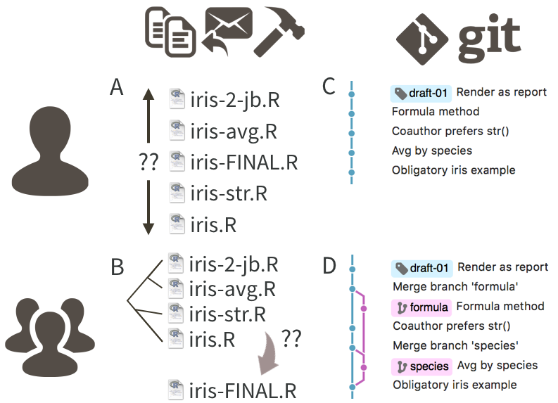

# excuse-me-iris

Toy repo used as an example in "Excuse me, do you have a moment to talk about version control?", a soon-to-appear article by Jennifer Bryan. *link to come*

This is the world's smallest and most boring analysis: we compute Species-specific median for the sepal and petal variables in the iris data. Yawn. It is meant to be boring, so we can just focus on the progression of small changes made to the source file [`iris.R`](iris.R).

Check out the [commit history](https://github.com/jennybc/excuse-me-iris/commits/master), which flows from bottom to top. Click on a commit to see the diff. Starting from the very bottom, I walk through the solo Git workflow depicted in panel C here:

I then reset -- literally, look for the commit with "Reset" as message! I then start over again and walk through the collaborative or, at least, branch-oriented, workflow depicted in panel D above.

I've placed two tags, [solo-end](https://github.com/jennybc/excuse-me-iris/releases/tag/solo-end) and [collab-end](https://github.com/jennybc/excuse-me-iris/releases/tag/collab-end), to mark the end of each example workflow. I didn't use the tag "draft-01", as I did in the article, because you can't really use the same tag twice in the same repo.

Notice how nice [`iris.md`](iris.md) looks when you visit it in the browser! This file can be produced via `rmarkdown::render("iris.Rmd")` or, equivalently, `rmarkdown::render("iris.R")`. If you use RStudio, you can do same by clicking on "Knit" in the `.Rmd` case or the "spiral notebook" button in the `.R` case.
